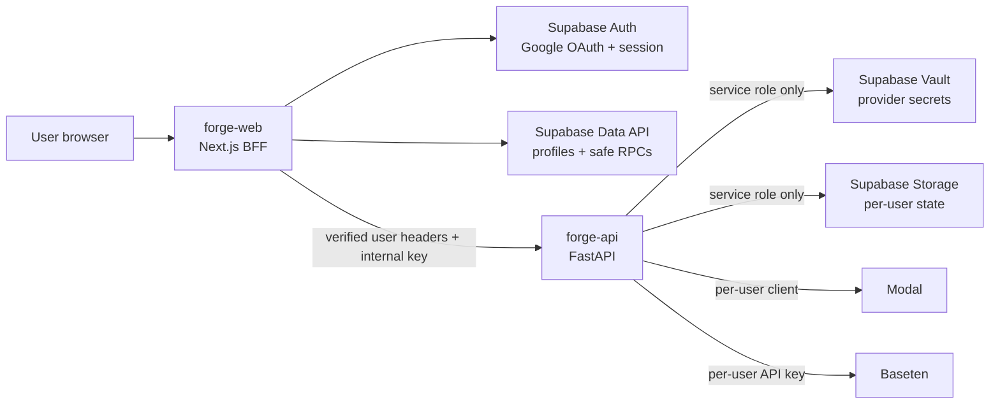

# Authentication and Provider Onboarding

Status: implemented and deployed. The four feature migrations listed below are
applied to the hosted Supabase project, and the founder account for
`bshamloufard@berkeley.edu` is bootstrapped with the existing provider
configuration. The Google Cloud OAuth client is the only remaining external
configuration gate; Forge keeps the Google actions disabled until Supabase
reports that the provider is enabled.

This runbook is the source of truth for Google sign-in, account creation,
replace-only provider credentials, per-user state, and the one-time onboarding
dialog.

## Contents

- [System architecture](#system-architecture)
- [User flows](#user-flows)
- [Supabase data and security contract](#supabase-data-and-security-contract)
- [Founder bootstrap](#founder-bootstrap)
- [Production configuration](#production-configuration)
- [Deployment runbook](#deployment-runbook)
- [Threat model](#threat-model)
- [Acceptance checklist](#acceptance-checklist)
- [Known MVP limitations](#known-mvp-limitations)
- [Rollback and incident response](#rollback-and-incident-response)

## System Architecture

Forge uses the web service as the authentication and tenant-isolation boundary.
Browsers never call the Python service directly and never receive Modal,
Baseten, Supabase secret, or internal API credentials.



The deployed services and canonical URLs are:

| Component | URL | Purpose |
| --- | --- | --- |
| Web | `https://forge-web-ykmh.onrender.com` | Landing page, OAuth callback, dashboard, account UI, and BFF |
| Python API | `https://forge-api-nvva.onrender.com` | Training, sampling, checkpoint, deployment, and verifier operations |
| Supabase | `https://uxlbzroevcdlyilfxviw.supabase.co` | Auth, profiles, Vault references, RPCs, and private Storage |
| Landing page | `https://forge-web-ykmh.onrender.com/` | Public homepage and Google sign-in |
| Default post-login page | `https://forge-web-ykmh.onrender.com/runs` | Authenticated dashboard |
| App OAuth callback | `https://forge-web-ykmh.onrender.com/auth/callback` | Exchanges the Supabase PKCE code for a session |

`app.forge-web-ykmh.onrender.com` is not a valid subdomain owned by this
project. Use the exact Render hostname above or add an owned custom domain such
as `app.example.com` in Render and update every OAuth URL together.

The production web service currently runs commit
`1132e3b8a8bd787ffb10ec9d3093850b8892ef03`. The secure API revision and database
migrations are live. Render auto-deploy tracks `main`, so merge pull request #9
before a later `main` deployment to make this release durable.

### Request Trust Boundary

1. The Next.js proxy refreshes Supabase cookies and uses `getClaims()` to guard
   dashboard routes.
2. Server components and route handlers use the canonical user returned by
   Supabase `getUser()`.
3. Every non-health BFF request revalidates the Supabase session.
4. The BFF discards caller-supplied tenant headers, derives the user UUID and
   email from the verified user, and sends:
   - `X-Forge-Internal-Key`
   - `X-Forge-User-Id`
   - `X-Forge-User-Email`
5. FastAPI checks the internal key with a constant-time comparison. Production
   fails closed with `503` if the key is missing.
6. Python validates the user UUID, loads only that user's provider credentials,
   and resolves only that user's Storage object.
7. Health endpoints remain public but do not report provider configuration.

All authenticated responses and session refreshes use private, no-store cache
headers. Production does not fall back to the local Next.js state adapter when
the Python service is unavailable.

## User Flows

### First Google Sign-In

1. The user opens `/` and selects **Continue with Google**.
2. `POST /auth/google` starts Supabase Google OAuth using PKCE. The requested
   `next` path is restricted to a relative, same-origin path.
3. Google returns to Supabase's provider callback.
4. Supabase returns an authorization code to `/auth/callback`.
5. Forge exchanges the code for cookie-backed session tokens and redirects to
   `/runs` by default.
6. The `auth.users` trigger creates or updates the user's `public.profiles` row.
7. The dashboard loads the safe account summary: identity metadata, onboarding
   status, and provider readiness booleans only.

### Atomic One-Time Onboarding

The dialog is claimed before it is displayed:

1. A new profile has `onboarding_seen_at = null`.
2. The authenticated dashboard server layout calls the claim RPC before
   rendering the page.
3. `public.claim_provider_onboarding()` executes:

   ```sql
   update public.profiles
   set onboarding_seen_at = now(), updated_at = now()
   where id = auth.uid()
     and onboarding_seen_at is null;
   ```

4. The RPC returns `true` only to the request that changed the row.
5. Forge displays the dialog only when the returned value is `true`.

This makes the behavior atomic across refreshes and simultaneous tabs. Closing
the dialog, skipping, closing the browser, or signing in later never opens it
again. Skipping does not mark Modal or Baseten ready; the bottom-left status and
Account page remain available for later setup.

The founder was bootstrapped with `onboarding_seen_at` already set, so the
dialog does not appear for the founder account.

### Saving or Replacing Provider Credentials

The onboarding dialog and `/account` use the same server-mediated endpoint:

1. The browser sends new values to `POST /api/account/providers` over TLS.
2. The route authenticates the user, limits the request size, validates the
   field shape, and requires the two Modal token fields to be supplied together.
3. The browser cannot choose the Baseten base URL. Forge keeps it fixed to the
   allowlisted service endpoint.
4. `public.save_provider_credentials()` scopes the write with `auth.uid()`.
5. New secrets are created or replace the existing Supabase Vault entries.
6. The response contains only readiness booleans and timestamps.
7. The UI clears all secret inputs. Existing plaintext is never loaded back
   into the browser.

Blank secret fields preserve the existing values. The current product offers
replacement, not reveal. Removing a provider credential requires an
administrative recovery procedure until a dedicated delete flow is added.

### Running Product Operations

For a training, serving, or verifier request:

1. The same-origin BFF authenticates the cookie or supported bearer token.
2. The BFF sends verified tenant headers and the shared internal key to Python.
3. Python calls the service-role-only
   `get_provider_credentials_for_service(user_id)` RPC.
4. Authenticated requests never fall back to the founder's process-level Modal
   or Baseten environment variables.
5. Modal uses `modal.Client.from_credentials()` per request.
6. Baseten calls use the request user's key and an HTTPS hostname allowlist.
7. Forge reads and writes the user's private state object at:

   ```text
   checkpoints/user-state/<auth-user-uuid>/forge-state.json
   ```

## Supabase Data and Security Contract

### Applied Feature Migrations

All four feature migrations are applied to the hosted project:

| Migration | Purpose |
| --- | --- |
| `20260724062721_forge_user_accounts_and_provider_vault.sql` | Profiles, Auth trigger, Vault-backed provider configuration, safe RPCs, and removal of broad authenticated table reads |
| `20260724063047_harden_provider_onboarding_and_status.sql` | Restricted onboarding updates, managed Baseten base URL, and real private-bucket readiness |
| `20260724064236_forge_atomic_onboarding_claim.sql` | Atomic first-dashboard onboarding claim |
| `20260724065201_remove_legacy_provider_onboarding_rpc.sql` | Removes the superseded non-atomic onboarding RPC from the exposed API surface |

Do not rewrite an applied migration. Add a new forward migration for future
changes.

### Profiles and RLS

`public.profiles.id` is the corresponding `auth.users.id`.

- RLS is enabled.
- Authenticated users can select only their own profile.
- Profile updates require both `USING (auth.uid() = id)` and
  `WITH CHECK (auth.uid() = id)`.
- Users cannot update `onboarding_seen_at` directly.
- The Auth trigger runs as a restricted security-definer function with an empty
  search path.
- Legacy broad `authenticated USING (true)` policies and grants on product
  tables are removed. Product data access is server-mediated.

### Vault Credential Model

`private.user_provider_credentials` stores:

- The owning Auth UUID.
- UUID references to three Vault secrets: Modal token ID, Modal token secret,
  and Baseten API key.
- Non-secret Modal app/environment and Baseten model configuration.
- Created and updated timestamps.

The table and helper functions are revoked from `public`, `anon`, and
`authenticated`. Authenticated users can call the scoped save/status RPCs, but
only `service_role` can call the function that reads `vault.decrypted_secrets`.
Deleting a credential row deletes its referenced Vault secrets.

Vault encrypts secrets at rest and in backups. Access to its decrypted view is
equivalent to access to the underlying provider accounts and must remain
backend-only.

### Storage Model

The `checkpoints` bucket is private. Forge uses its Supabase server key to store
one control-plane JSON document per Auth UUID. The object path is derived from a
validated UUID; it is never accepted from a request.

Browser roles currently have no direct `storage.objects` policy. All state
access goes through FastAPI, which receives identity only from the authenticated
BFF.

Storage readiness means the private `checkpoints` bucket exists. New users do
not provide Supabase credentials because Forge supplies the shared storage.

## Founder Bootstrap

The founder account is already bootstrapped:

- Email: `bshamloufard@berkeley.edu`
- Auth user: created and email-confirmed
- App metadata: founder role assigned
- Modal and Baseten secrets: stored in Vault and verified without printing them
- Onboarding: marked seen
- State: initialized at the founder's UUID-scoped Storage path

The script is idempotent for account lookup, provider-secret replacement, and
state initialization:

```bash
npm run bootstrap:founder
```

Run it only from a trusted workstation or protected CI job whose environment
contains the Supabase server key and the provider credentials. Do not pass
secrets as command-line arguments, commit them, paste them into SQL, or capture
them in build logs. Successful output reports the email and a redacted
verification result only.

Rerun the script only to recover the founder account or rotate the founder's
stored provider values. After the first Google login, verify that Supabase links
the Google identity to the existing confirmed-email Auth user rather than
creating a second user.

## Production Configuration

### Google Cloud OAuth Client

Use a Web application OAuth client.

Authorized JavaScript origins:

```text
https://forge-web-ykmh.onrender.com
http://localhost:3000
```

Authorized redirect URIs:

```text
https://uxlbzroevcdlyilfxviw.supabase.co/auth/v1/callback
http://127.0.0.1:54321/auth/v1/callback
```

The Google redirect URI is the Supabase callback, not the Forge callback. Store
the Google client ID and secret in the Supabase Google provider configuration;
they do not belong in Render.

Request only basic sign-in identity scopes: `openid`, email, and profile. Before
a public branded launch, configure the consent screen, support email, homepage,
privacy policy, terms link, and owned-domain verification required by Google.

### Supabase Auth

In **Authentication → URL Configuration**, set:

```text
Site URL:
https://forge-web-ykmh.onrender.com

Redirect allow list:
https://forge-web-ykmh.onrender.com/auth/callback
http://localhost:3000/auth/callback
http://127.0.0.1:3000/auth/callback
```

In **Authentication → Providers → Google**:

- Enable Google.
- Set the Google Web client ID.
- Set the Google client secret.
- Keep new-user sign-up enabled for the public signup flow.
- After a successful founder and test-user Google smoke, disable the Email
  provider if Forge is intended to be Google-only. Leaving Email enabled allows
  direct email/password signup through the Supabase Auth API even though the
  Forge landing page does not advertise it.

### Render

Existing Blueprint services ignore newly introduced `sync: false` values during
later syncs. Add or verify those values manually in the Render Dashboard.

`forge-web`:

| Variable | Production value/source |
| --- | --- |
| `APP_ENV` | `production` |
| `APP_BASE_URL` | `https://forge-web-ykmh.onrender.com` |
| `API_INTERNAL_BASE_URL` | `https://forge-api-nvva.onrender.com` |
| `NEXT_PUBLIC_API_BASE_URL` | Empty; browsers use same-origin BFF routes |
| `NEXT_PUBLIC_SUPABASE_URL` | `https://uxlbzroevcdlyilfxviw.supabase.co` |
| `NEXT_PUBLIC_SUPABASE_PUBLISHABLE_KEY` | Supabase publishable key |
| `INTERNAL_API_KEY` | `fromService` reference to `forge-api` |

`forge-api`:

| Variable | Production value/source |
| --- | --- |
| `APP_ENV` | `production` |
| `FORGE_ALLOWED_ORIGINS` | `https://forge-web-ykmh.onrender.com` |
| `SUPABASE_URL` | `https://uxlbzroevcdlyilfxviw.supabase.co` |
| `SUPABASE_SECRET_KEY` | Supabase server secret |
| `SUPABASE_SERVICE_ROLE_KEY` | Legacy fallback only, if still required |
| `INTERNAL_API_KEY` | Render-generated value |
| `ARTIFACT_BUCKET` | `checkpoints` or the application default |

Never expose the Supabase secret/service-role key or internal key through a
`NEXT_PUBLIC_` variable. The two free Render web services cannot use private
networking, so the internal-key check is required even though traffic is
server-to-server.

The Blueprint no longer provisions process-level `MODAL_TOKEN_ID`,
`MODAL_TOKEN_SECRET`, or `BASETEN_API_KEY`, and the legacy production copies have
been removed after the founder's Vault-backed smoke test. Authenticated requests
fail closed instead of using process-level founder credentials, making Vault the
single production source.

## Deployment Runbook

### 1. Preflight

From a clean checkout of the intended commit:

```bash
npm ci
npm run api:test
npm run build
render blueprints validate render.yaml
```

The release gate is:

```bash
npm run lint
```

The project uses ESLint's flat configuration because Next.js 16 no longer
provides the old `next lint` command.

For future database changes:

```bash
npx supabase link --project-ref uxlbzroevcdlyilfxviw
npx supabase migration list --linked
npx supabase db push --dry-run --linked
npx supabase db push --linked
```

Use `supabase db reset --no-seed` for local migration validation until a local
seed file exists. Never run `db reset` against the hosted project.

### 2. Verify External Configuration

1. Enable and configure Google in Supabase.
2. Verify the exact Google and Supabase URLs above.
3. Verify all Render environment variable names without printing their values.
4. Sync the Blueprint so `forge-web` references the API-generated internal key.
5. Confirm the web service has no non-empty public API base.

### 3. Deploy Safely

The feature database migrations and founder bootstrap are already complete.

For the safest transition from the legacy direct-browser API:

1. Deploy `forge-web` first. The new BFF sends the internal key and tenant
   identity; the legacy API ignores the extra headers.
2. Verify authenticated BFF requests reach the API.
3. Deploy `forge-api` to enforce the internal key and request-scoped credentials.
4. Verify direct non-health requests to the Python URL now return `401`.
5. Verify both health checks:

   ```bash
   curl -fsS https://forge-api-nvva.onrender.com/health
   curl -fsS https://forge-web-ykmh.onrender.com/api/health
   ```

Do not deploy a new API that enforces the internal key before the web service
has received the matching `fromService` value.

### 4. Production Smoke

Run the acceptance checklist below with the founder and a separate test Google
account. Keep browser developer tools open and inspect responses, HTML,
localStorage, and cookies for accidental provider-secret exposure.

After the test account creates state, restart or redeploy the API and confirm
the state remains. This verifies Supabase Storage is active instead of the
ephemeral Render filesystem.

## Threat Model

| Threat | Control | Residual risk |
| --- | --- | --- |
| Public callers trigger provider-spending operations | Same-origin authenticated BFF, server-only internal key, production fail-closed API | Internal-key compromise requires immediate rotation |
| Caller spoofs another tenant | BFF overwrites identity headers from Supabase `getUser()`; Python validates UUID | Python trusts the BFF/internal-key boundary rather than independently validating a user JWT |
| User reads another user's profile or credentials | `auth.uid()` RLS/RPC scoping; private credential table; service-role-only decrypted RPC | A leaked Supabase server key bypasses RLS |
| Provider plaintext reaches the browser | Replace-only form, blank responses, Vault references, no decrypted client RPC | Browser extensions can observe values while the user types them |
| Founder keys leak to skipped/new users | Authenticated request settings start with provider secrets cleared; per-user Vault lookup | Legacy process-level keys should still be removed after smoke testing |
| OAuth open redirect or host confusion | Relative-path sanitization and fixed `APP_BASE_URL` | Every custom-domain change must update Google, Supabase, and Render together |
| Cached session or account response leaks | Private/no-store headers on proxy, callback, account, and BFF responses | Upstream cache configuration must continue honoring these headers |
| Baseten endpoint becomes SSRF target | Managed base URL constraint and HTTPS Baseten hostname allowlist | Future provider hosts require reviewed allowlist changes |
| Onboarding appears more than once | Atomic update where `onboarding_seen_at is null`; only the winning request displays it | Administrators can intentionally reset the timestamp |
| Cross-user Storage access | UUID-derived object path and backend-only server key | Whole-document writes are not transactional |

If a provider credential appears in a response, log, error trace, analytics
event, committed file, or client storage, treat it as compromised and rotate it.

## Acceptance Checklist

### Authentication

- [ ] `/` is public and shows the Google sign-in action.
- [ ] An unauthenticated request to `/runs` redirects to `/` with a safe relative
      return path.
- [ ] Google sign-in returns through Supabase and `/auth/callback`, then lands on
      `/runs`.
- [ ] An invalid or expired session receives `401` from protected BFF routes.
- [ ] Sign-out uses `POST`, clears the local session, and returns to `/`.
- [ ] The founder Google identity links to the existing
      `bshamloufard@berkeley.edu` Auth user.

### Onboarding and Account

- [ ] A new Google user gets a profile automatically.
- [ ] The onboarding dialog opens once on the first dashboard load.
- [ ] With two simultaneous first-load tabs, at most one dialog opens.
- [ ] Skip, close, refresh, sign-out/sign-in, and later visits do not reopen it.
- [ ] The founder does not see the dialog.
- [ ] Account and bottom-left status links remain available after skipping.
- [ ] Storage is ready for every account when the private bucket exists.
- [ ] Modal and Baseten remain not ready until their credential references exist.

### Credential Security

- [ ] Modal token ID and secret must be replaced together.
- [ ] Saving clears secret fields and never returns stored plaintext.
- [ ] Refreshing `/account` leaves all secret inputs blank.
- [ ] Replacing one provider does not reveal or erase an omitted provider.
- [ ] Responses, server logs, Render logs, HTML, localStorage, and analytics
      contain no provider plaintext.
- [ ] `anon` and `authenticated` roles cannot call the decrypted credential RPC.
- [ ] User A cannot select, update, invoke, or read User B's profile, provider
      configuration, or state.

### API and Providers

- [ ] Direct Python `/v1/**` and state routes reject missing or incorrect internal
      keys.
- [ ] Public health responses contain no provider readiness details.
- [ ] An authenticated BFF request is scoped to the verified user UUID.
- [ ] The founder can run the existing Modal workflow with Vault credentials.
- [ ] A new user's Modal token can access the configured app and environment.
- [ ] Baseten serving uses the saved user key and rejects a non-Baseten endpoint.
- [ ] Missing or invalid provider configuration fails without falling back to
      founder credentials.

### Persistence and Deployment

- [ ] All four feature migrations appear in the hosted migration history.
- [ ] The founder profile, credential references, and state object exist.
- [ ] A new user's state object uses only that Auth UUID in its path.
- [ ] User state survives API restart, spin-down, and redeploy.
- [ ] `forge-web` has the API's generated internal key through `fromService`.
- [ ] `NEXT_PUBLIC_API_BASE_URL` is empty in production.
- [ ] The Next.js build, Python tests, Render Blueprint validation, and manual
      OAuth smoke all pass.

## Known MVP Limitations

- Render's free services spin down and have cold starts. Their filesystems are
  ephemeral; authenticated state durability depends on Supabase Storage.
- Per-user control-plane state is one JSON object. Read-modify-write operations
  are last-write-wins and can lose concurrent mutations. Move this state to
  transactional Postgres rows or add optimistic versioning before scaling.
- The Storage object contains control-plane metadata. Current model checkpoint
  binaries remain in the user's Modal Volume and are referenced with
  `modal-volume://` URIs.
- Provider readiness currently means credential references exist. It does not
  prove the token is valid or that the expected provider resource exists.
- A user's Modal account must already contain the configured `forge-mvp`
  functions and environment. Forge does not deploy those functions during
  onboarding.
- Supabase Vault is currently a public-alpha product. Reassess its maturity and
  recovery model before compliance-sensitive use.
- FastAPI authenticates the trusted BFF with the internal key and then trusts
  BFF-derived identity headers. It does not independently verify the Supabase
  user JWT.
- There is no provider-secret delete UI, only replace. Administrative deletion
  must delete the credential row so the cleanup trigger removes Vault entries.
- The project still needs automated Playwright coverage for real OAuth callback,
  first-login onboarding, and two-account isolation, plus database-level RLS
  tests.
- A public Google-branded launch may require homepage, privacy policy, terms,
  domain ownership, and brand review beyond the technical OAuth setup.

## Rollback and Incident Response

The feature migrations are additive. Prefer rolling back application code while
leaving profiles and encrypted credentials intact.

### Emergency Stop

1. Disable new signups or the Google provider in Supabase.
2. Keep the current Python internal-key enforcement in place.
3. If the internal key might be exposed, rotate the API value and refresh the
   web `fromService` reference before restoring traffic.
4. If a provider credential might be exposed, rotate it at Modal or Baseten,
   then replace the stored value in Forge.
5. Preserve Supabase Storage objects and database rows for investigation.

Do not roll the Python service back to an unauthenticated build while provider
credentials are active.

### Application Rollback

1. Roll `forge-web` back to the last auth-capable version.
2. Leave `forge-api` on a version that requires the internal key.
3. Confirm health endpoints, then test one authenticated BFF request.
4. Keep Google signup disabled until the account and tenant-isolation smoke
   tests pass.

### Data Rollback

Do not drop the applied tables or functions during an incident. A later,
reviewed cleanup migration may:

1. Back up profile metadata and user state.
2. Disable signup and provider writes.
3. Revoke affected RPC grants.
4. Delete credential rows, allowing the trigger to delete their Vault secrets.
5. Rotate provider credentials outside Forge.
6. Drop feature objects only after retention and recovery requirements are met.

For founder recovery, rerun the bootstrap script with newly rotated provider
credentials from a trusted environment. It preserves an existing state object.

## Reference Documentation

- [Supabase Google login](https://supabase.com/docs/guides/auth/social-login/auth-google)
- [Supabase SSR clients and `getClaims()`](https://supabase.com/docs/guides/auth/server-side/creating-a-client?framework=nextjs&queryGroups=framework)
- [Supabase redirect URLs](https://supabase.com/docs/guides/auth/redirect-urls)
- [Supabase Vault](https://supabase.com/docs/guides/database/vault)
- [Supabase private Storage downloads](https://supabase.com/docs/guides/storage/serving/downloads)
- [Render Blueprint specification](https://render.com/docs/blueprint-spec)
- [Render free-service limitations](https://render.com/docs/free)
- [Modal credential-scoped clients](https://modal.com/docs/sdk/py/latest/modal.Client)
- [Baseten API-key guidance](https://docs.baseten.co/organization/api-keys)
